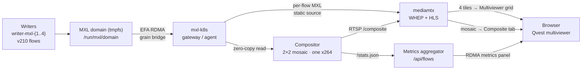

# mxl-dmf-demo-app

A Kubernetes demo for MXL DMF showing zero-copy RDMA transport of uncompressed video flows across nodes, composited live and streamed to a browser multiviewer.

## What it demonstrates

- **Cross-node RDMA/EFA flow mirroring via mxl-k8s** — writer pods produce v210 test-pattern flows into a shared tmpfs domain; the mxl-k8s gateway/agent DaemonSet pair bridges grains across nodes via libmxl-fabrics (EFA provider), making each flow available on the consumer node without a copy.
- **Per-flow delivery straight from the RDMA domain** — mediamtx reads each MXL flow directly from the domain via its MXL static-source plugin and serves it as an independent WHEP/HLS stream. The default Multiviewer grid is four independent, RDMA-delivered tiles — the compositor is *not* in that path.
- **Zero-copy multi-flow compositing via libmxl** — separately, the C++/GStreamer compositor reads all flows zero-copy, lays them out in a single GStreamer compositor element, and encodes a 2 × 2 mosaic once with x264 (no per-flow decode pass). That mosaic is the separate Composite tab.
- **Live WebRTC and HLS delivery** — mediamtx serves both paths via WHEP (WebRTC) with HLS as fallback, rendered in-browser by hls.js.

## How it works

Four writer pods (`writer-mxl-{1..4}`) each produce one uncompressed v210 720p test-pattern flow — smpte, ball, gamut, checkers-8 — into `/run/mxl/domain` on whichever node the scheduler assigns them. When a writer lands on a different node than the pod reading it, the **mxl-k8s gateway DaemonSet** on the writer's node picks up the new flow under `/run/mxl/domain` (via fanotify) and bridges the raw grains across the EFA fabric; the **mxl-k8s agent DaemonSet** on the consumer's node materialises the mirror at `/run/mxl/domain` so it looks local. The intent shim (`libmxl-intent.so`, injected by an init container) blocks the consumer's first `mxlCreateFlowReader` call until the agent signals that the mirror is ready, so startup and reschedule don't race into `FLOW_NOT_FOUND`.

Two consumers read that domain, both zero-copy. **mediamtx** reads each flow through its MXL static-source plugin (`mxl:///run/mxl/domain/<uuid>`) and serves it as an independent H.264 stream — those four streams are the default **Multiviewer** grid. Independently, the **compositor** (`compositor/`) reads all four flows, lays them out in a `ceil(sqrt(n))` × `ceil(n / cols)` mosaic — 2 × 2 for four flows — encodes once with x264, and pushes the result to mediamtx over RTSP at `rtsp://mediamtx:8554/composite`; that mosaic is the separate **Composite** tab.

mediamtx serves every path as both a WHEP endpoint (WebRTC) and an HLS playlist. The **multiviewer** (`k8s/config/index.html`) tries WebRTC per tile and falls back to hls.js when the WHEP handshake fails. Its side panel polls `GET /api/flows` on the **metrics aggregator** (`k8s/metrics/aggregator.py`), which merges the flow definitions with writer pod state and the `MxlReceiver` / `MxlFlowMirror` / `MxlFlow` custom resources.

## Architecture

## Repository layout

| Path | Contents |
|------|----------|
| `compositor/` | C++/GStreamer compositor source and vendored mxl headers; built by a separate CI workflow (`build-compositor.yml`) and pushed to GHCR. |
| `k8s/` | **The deliverable** — all Kubernetes manifests (`writer-deployment.yaml`, `composite-deployment.yaml`, `mediamtx-*.yaml`, etc.), `config/` (mediamtx config, Caddyfile, `index.html` served by the Caddy sidecar), and `metrics/` (the Python metrics aggregator). Rendered by kustomize and pushed as an OCI artifact on every CI run. |
| `.github/` | CI: `build.yml` pushes the rendered `k8s/` tree as a Flux OCI artifact; `build-compositor.yml` builds and pushes the compositor image; release-please manages the RC version series. |

## Deploying

There is no local `docker compose` or `kubectl apply -f .` path — the cluster pulls everything from CI artifacts. On every push to `main` (or a version tag), the `Push manifests` workflow renders `k8s/` with kustomize and pushes it as an OCI artifact (`ghcr.io/qvest-digital/mxl-dmf-demo-app-manifests`) that Flux reconciles onto the cluster. The compositor image is built and pushed separately.

## Documentation

- [docs/architecture.md](docs/architecture.md) — deep-dive into the MXL domain, mxl-k8s control plane, compositor pipeline, and mediamtx integration.
- [docs/ci-and-release.md](docs/ci-and-release.md) — CI pipeline structure, OCI artifact tagging, PR environments, and the release-please RC workflow.

## Versioning

Releases follow a `1.0.0-rc.N` pre-release series managed by release-please (conventional commits → semver, prerelease type `rc`). See [CHANGELOG.md](CHANGELOG.md) for the full history and the [GitHub releases page](https://github.com/qvest-digital/mxl-dmf-demo-app/releases) for tagged artifacts.
